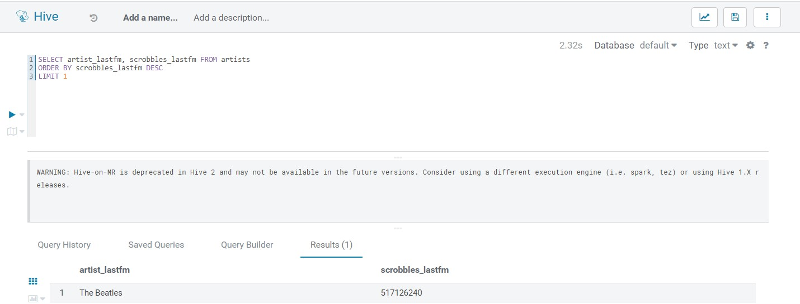
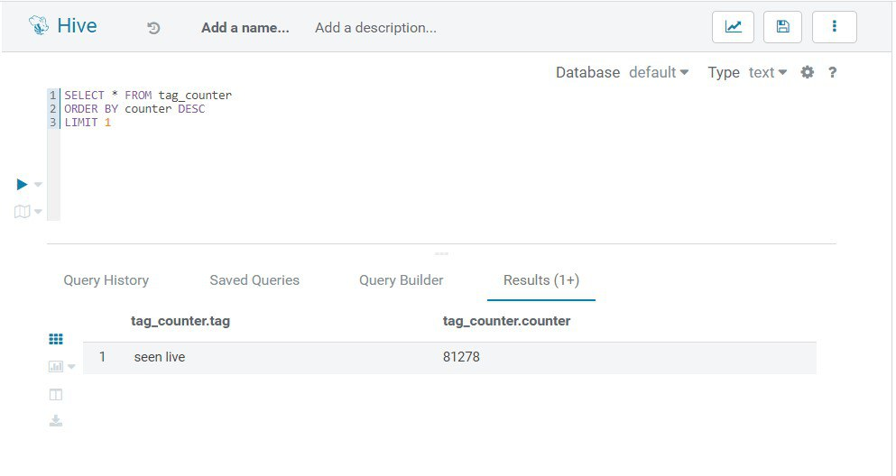
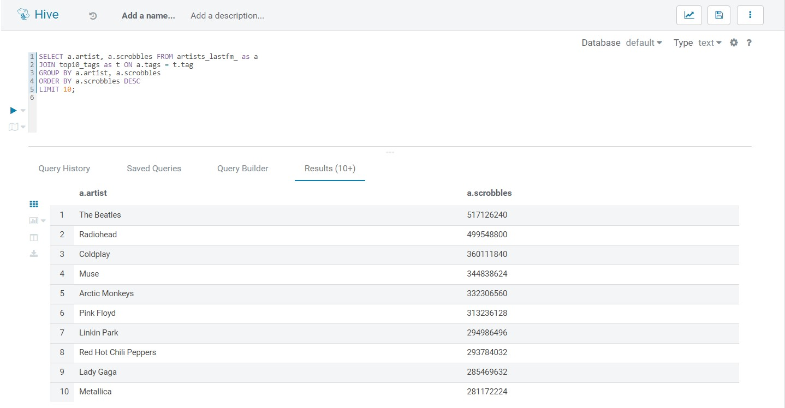
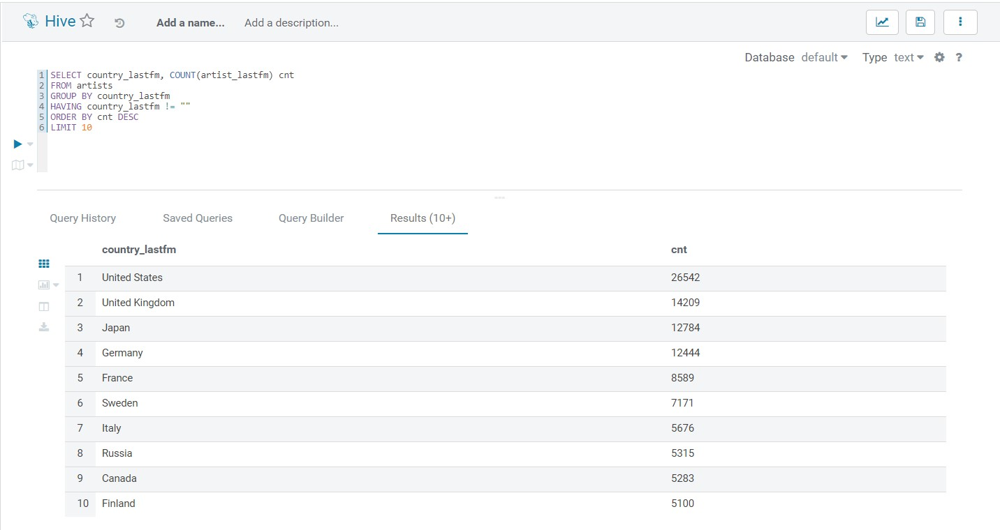

### a) Вывести исполнителя с максимальным числом скробблов
~~~
SELECT artist_lastfm, scrobbles_lastfm 
FROM artists 
ORDER BY scrobbles_lastfm DESC 
LIMIT 1![]
~~~

### b) Самый популярный тэг на ластфм
~~~
CREATE VIEW tag_counter (tag, counter) 
AS SELECT tags, COUNT(*) counter 
FROM artists 
LATERAL VIEW EXPLODE(SPLIT(tags_lastfm, ";")) tag as tags 
GROUP BY tags  
HAVING tags != "" 

SELECT * FROM tag_counter
ORDER BY counter DESC
LIMIT 1
~~~

### c) Самые популярные исполнители 10 самых популярных тегов ластфм
~~~
CREATE VIEW top10_tags (tag, counter) AS 
SELECT tags, COUNT(*) counter 
FROM artists 
LATERAL VIEW EXPLODE(SPLIT(tags_lastfm, ";")) tag as tags  
GROUP BY tags 
HAVING tags != "" 
ORDER BY counter DESC 
LIMIT 10;

CREATE VIEW artists_lastfm (artist, tags, scrobbles) AS  
SELECT artist_lastfm, tags, scrobbles_lastfm 
FROM artists LATERAL VIEW EXPLODE(SPLIT(tags_lastfm, ";")) tag as tags 
GROUP BY artist_lastfm, tags, scrobbles_lastfm  
HAVING tags != "" AND artist_lastfm != "";

SELECT a.artist, a.scrobbles FROM artists_lastfm as a
JOIN top10_tags as t ON a.tags = t.tag
GROUP BY a.artist, a.scrobbles
ORDER BY a.scrobbles DESC
LIMIT 10;
~~~

### d) Любой другой инсайт на ваше усмотрение
### Топ 10 стран по кол-ву исполнителей
~~~
CREATE VIEW top_countries (country, num_artists) AS 
SELECT country_lastfm, COUNT(artist_lastfm) cnt 
FROM artists 
GROUP BY country_lastfm 
HAVING country_lastfm != "" 
ORDER BY cnt 
DESC LIMIT 10
~~~
